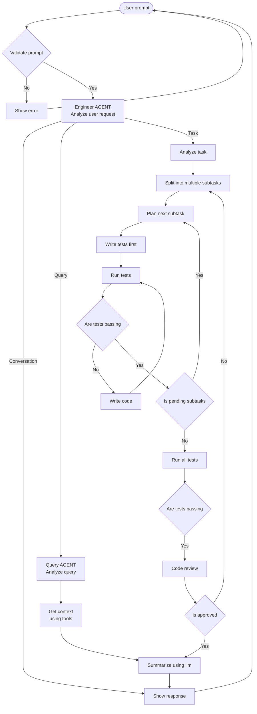

# TypeScript Developer Agent – Flowchart

```mermaid
flowchart TD
    A([User prompt]) --> B{Validate prompt}
    B -- No --> C[Show error]
    C --> A
    B -- Yes --> D[Engineer AGENT<br/>Analyze user request]
    D -- Conversation --> I[Show response]
    I --> A
    D -- Query --> E[Query AGENT<br/> Analyze query]
    E --> H[Get context<br/>using tools]
    H --> J[Summarize using llm]
    J --> I
    D -- Task --> V[Analyze task]
    V --> K[Split into multiple subtasks]
    K --> L[Plan next subtask]
    L --> M[Write tests first]
    M --> N[Run tests]
    N --> O{Are tests passing}
    O -- No --> P[Write code]
    P --> N
    O -- Yes --> Q{Is pending subtasks}
    Q -- Yes --> L
    Q -- No --> R[Run all tests]
    R --> S{Are tests passing}
    S -- Yes --> T[Code review]
    T --> U{is approved}
    U -- Yes --> J
    U -- No --> K
```
