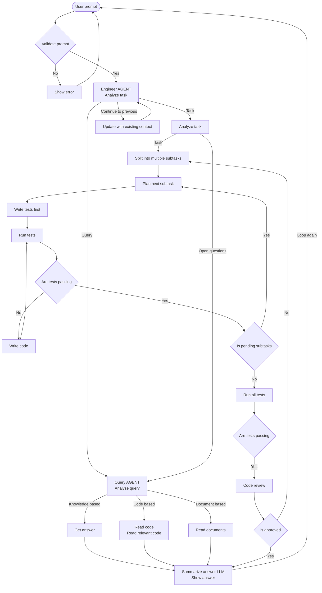

# TypeScript Developer Agent – Flowchart

```mermaid
flowchart TD
    A([User prompt]) --> B{Validate prompt}
    B -- No --> C[Show error]
    C --> A
    B -- Yes --> D[Engineer AGENT<br/>Analyze task]
    D -- Query --> E[Query AGENT<br/> Analyze query]
    E -- Knowledge based --> F[Get answer]
    F --> G[Summarize answer LLM<br/>Show answer]
    G -- Loop again --> A
    E -- Code based --> H[Read code<br/>Read relevant code]
    H --> G
    E -- Document based --> J[Read documents]
    J --> G
    D -- Task --> V[Analyze task]
    V -- Task --> K[Split into multiple subtasks]
    V -- Open questions --> E
    K --> L[Plan next subtask]
    L --> M[Write tests first]
    M --> N[Run tests]
    N --> O{Are tests passing}
    O -- No --> P[Write code]
    P --> N
    O -- Yes --> Q{Is pending subtasks}
    Q -- Yes --> L
    Q -- No --> R[Run all tests]
    R --> S{Are tests passing}
    S -- Yes --> T[Code review]
    T --> U{is approved}
    U -- Yes --> G
    U -- No --> K

    D -- Continue to previous --> W[Update with existing context]
    W --> D
```
