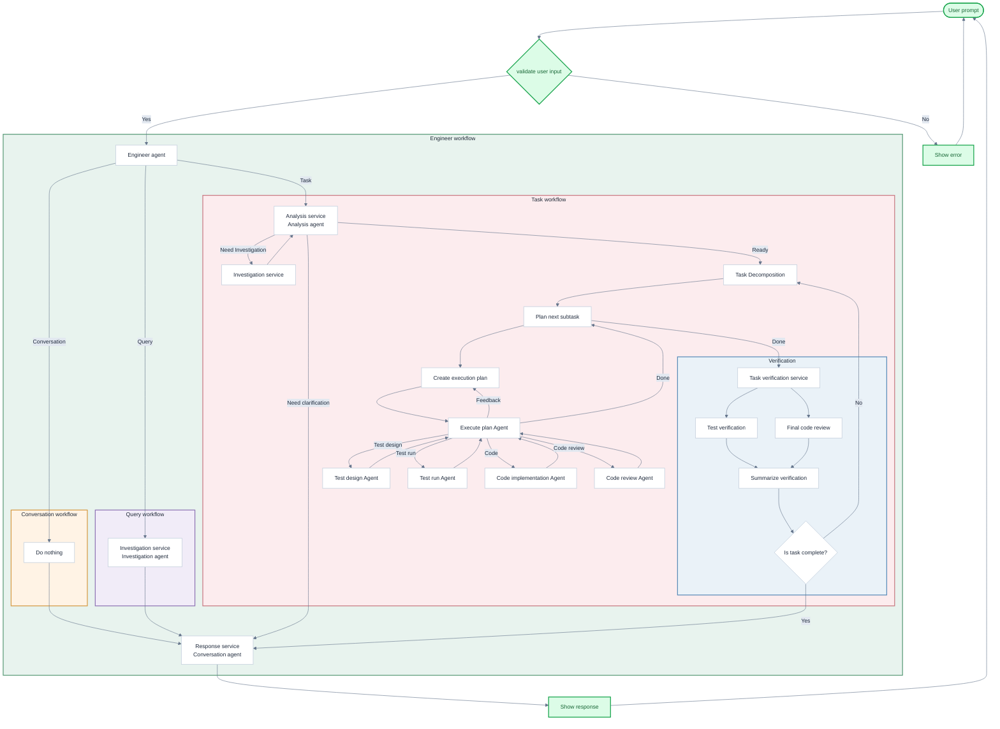

# TypeScript Developer Agent – Flowchart

```mermaid

%%{init: {
  "theme": "base",
  "themeVariables": {
    "background": "#F8FAFC",
    "mainBkg": "#FFFFFF",
    "primaryColor": "#FFFFFF",
    "primaryTextColor": "#1E293B",
    "primaryBorderColor": "#CBD5E1",
    "lineColor": "#64748B",
    "edgeLabelBackground": "#E2E8F0",
    "secondaryColor": "#F1F5F9",
    "tertiaryColor": "#F8FAFC",
    "fontFamily": "Inter, Arial, sans-serif",
    "fontSize": "14px"
  },
  "flowchart": {
    "curve": "basis",
    "nodeSpacing": 45,
    "rankSpacing": 55,
    "padding": 15,
    "htmlLabels": true
  }
}}%%

flowchart TD
    A([User prompt])
    G{validate user input}
    H[Show error]
    Z[Show response]

    subgraph B["Engineer workflow"]
        subgraph C["Conversation workflow"]
            C1[Do nothing]
        end

        subgraph D["Query workflow"]
            D1[Investigation service<br/>Investigation agent]
        end

        subgraph E["Task workflow"]
            E1[Analysis service<br/>Analysis agent]
            E2[Investigation service]
            E3[Task Decomposition]
            E4[Plan next subtask]
            E5[Create execution plan]
            E6[Execute plan Agent]
            E7[Test design Agent]
            E8[Test run Agent]
            E9[Code implementation Agent]
            E10[Code review Agent]

            subgraph F["Verification"]
                F1[Task verification service]
                F2[Test verification]
                F3[Final code review]
                F4[Summarize verification]
                F5{Is task complete?}

                F1 --> F2
                F1 --> F3
                F2 --> F4
                F3 --> F4
                F4 --> F5

            end

            E1 -- Need Investigation --> E2
            E2 --> E1
            E1 -- Ready --> E3
            E3 --> E4
            E4 --> E5
            E5 --> E6
            E6 -- Test design --> E7
            E6 -- Test run --> E8
            E6 -- Code --> E9
            E6 -- Code review --> E10
            E7 --> E6
            E8 --> E6
            E9 --> E6
            E10 --> E6
            E6 -- Feedback --> E5
            E6 -- Done --> E4
            E4 -- Done --> F1
            F5 -- No --> E3

        end

        B1[Engineer agent]
        B2[Response service<br/>Conversation agent]

        C1 --> B2
        B1 -- Conversation --> C1
        B1 -- Query --> D1
        B1 -- Task --> E1
        D1 --> B2
        E1 -- Need clarification --> B2
        F5 -- Yes --> B2
    end

    A --> G
    G -- No --> H
    G -- Yes --> B1
    H --> A
    B2 --> Z
    Z --> A

    style B fill:#E8F3EE,stroke:#5A9B78,stroke-width:2px,color:#1F2937
    style C fill:#FFF3E5,stroke:#D69A45,stroke-width:2px,color:#1F2937
    style D fill:#F1ECF8,stroke:#9075B5,stroke-width:2px,color:#1F2937
    style E fill:#FCECEE,stroke:#C87982,stroke-width:2px,color:#1F2937
    style F fill:#EAF2F8,stroke:#5B8DB8,stroke-width:2px,color:#1F2937

    style A fill:#DCFCE7,stroke:#16A34A,color:#166534,stroke-width:2px
    style G fill:#DCFCE7,stroke:#16A34A,color:#166534,stroke-width:2px
    style H fill:#DCFCE7,stroke:#16A34A,color:#166534,stroke-width:2px
    style Z fill:#DCFCE7,stroke:#16A34A,color:#166534,stroke-width:2px

    classDef default fill:#FFFFFF,stroke:#CBD5E1,stroke-width:1.5px,color:#1E293B
```
